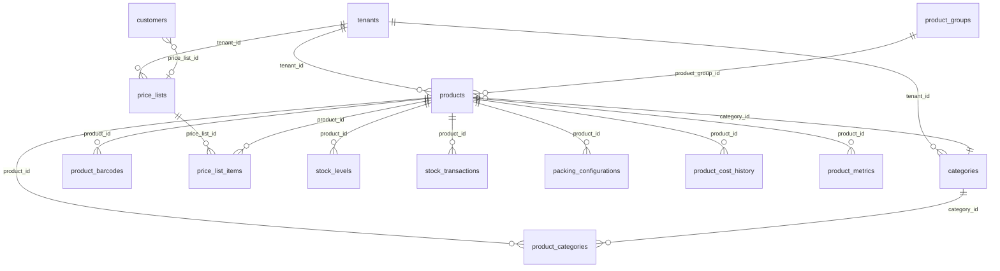

# Trity — Products module: schema, relationships, and application map

This document describes the **Products** domain as implemented in this repository: PostgreSQL / Supabase objects, RLS, how the Next.js app reads and writes data, and known gaps. It is intended as context for schema and UX improvements.

**Primary sources**

- Generated types: `types/database.ts` (table/view `Row` shapes, FK hints, enums).
- DDL / RLS / indexes / views: `supabase/migrations/20260405103000_business_core_schema_consolidation.sql` (and follow-ups cited below).
- App: `hooks/useProducts.ts`, `hooks/usePriceLists.ts`, `app/products/**`, `components/products/**`, `components/priceLists/**`.

---

## 1. Database schema

### 1.1 Core product tables (tenant-scoped)

All of the following include **`tenant_id uuid NOT NULL`** (FK to `tenants`), with RLS applied in consolidation migration §13 (policy names `bc_<table>_{select,insert,update,delete}`). See [§ 1.5 RLS](#15-row-level-security-rls).

Column lists below follow **`types/database.ts`** `Row` types (TypeScript names; DB uses snake_case). For exact SQL types and `NOT NULL` defaults, treat migrations + live DB as authoritative; consolidation enforces **numeric(18,6)** for several money fields.

#### `products` (lines ~2592–2772 in `types/database.ts`)

| Column | TS / logical type | Notes |
|--------|-------------------|--------|
| `id` | `string` (uuid) | PK |
| `tenant_id` | `string` | Tenant scope |
| `sku` | `string` | Unique per tenant (`uq_products_tenant_sku`, migration §9) |
| `name` | `string` | |
| `description`, `short_description` | `string \| null` | |
| `product_type` | enum `product_type` | |
| `industry_type` | enum `industry_type` | |
| `status` | enum `status_type \| null` | |
| `category_id` | `string \| null` | FK → `categories` (single “primary” category on master) |
| `cost_price`, `sell_price` | `number \| null` | `numeric(18,6)` in DB; CHECK ≥ 0 (consolidation §6) |
| `weighted_avg_unit_cost` | `number \| null` | Inventory costing |
| `currency` | `string \| null` | |
| `tracks_inventory` | `boolean` | Default true; `NOT NULL` added in `20260406100000_product_tracks_inventory_packaging_type.sql` |
| `min_stock_level`, `max_stock_level`, `reorder_point`, `reorder_quantity` | `number \| null` | |
| `lead_time_days` | `number \| null` | |
| Physical / units | `weight`, `length`, `width`, `height`, `volume`, `*_unit_id` | FKs to `units` where set |
| Quality | `shelf_life_days`, `storage_conditions`, `allergens`, `certifications`, `safety_rating` | |
| Manufacturing / traceability | `default_supplier_id`, `manufacturer_part_number`, `batch_tracked`, `serial_tracked`, `lot_controlled` | |
| Media | `image_url`, `images`, `documents`, `specifications_url` | JSON / text |
| `attributes`, `metadata`, `tags` | JSON / arrays | |
| Integration | `external_system`, `external_id`, `integration_metadata`, `last_synced_at` | Consolidation §4 |
| Audit | `user_id`, `created_by`, `updated_by`, `created_at`, `updated_at`, `version` | |
| `is_active`, `is_deleted` | flags | App uses **`is_deleted`** for soft archive |

**Indexes (non-exhaustive):** `idx_products_tenant_id`, partial unique `uq_products_tenant_external`, `idx_products_tenant_external_system` (consolidation §9–§11).

#### `product_groups` (tenant catalogue: grouped / matrix)

Replaces legacy `product_variants` (dropped in `20260419105000_tenant_catalogue_settings.sql`). Each **variant is a full `products` row** linked by `product_group_id`.

| Column | Notes |
|--------|--------|
| `tenant_id`, `name`, `description` | |
| `category_id` | Optional FK → `categories` |
| `attribute_dimensions` | `jsonb` — matrix axes, e.g. `dimensions` order + value arrays per key |
| `image_url`, `tags`, `is_active`, `is_deleted` | |
| `created_by`, `created_at`, `updated_at` | `updated_at` maintained by trigger |

**Products:** `product_group_id` (nullable FK), `variant_attributes` (`jsonb`, e.g. `{ "size": "M", "colour": "Red" }`).

**Tenants:** `catalogue_mode` ∈ `simple` \| `grouped` \| `matrix` (default `simple`).

#### `product_barcodes` (~2043–2135)

| Column | Notes |
|--------|--------|
| `product_id` | FK → `products` |
| `barcode` | Text |
| `barcode_type` | Enum `barcode_type` |
| `packing_level` | Enum `packing_level \| null` |
| `quantity` | Units per barcode (e.g. case pack) |
| `is_primary`, `is_active`, `description` | |
| `metadata`, integration fields | |

#### `product_categories` (~2137–2206) — junction

Many-to-many **product ↔ category** (in addition to `products.category_id`).

| Column | Notes |
|--------|--------|
| `product_id`, `category_id` | FKs |
| Partial unique | `uq_product_categories_alive` on `(tenant_id, product_id, category_id) WHERE is_deleted = false` |

#### `categories` (~556–639)

Master category tree per tenant: `name`, `industry_type` (enum), `parent_id` (self-FK), `code`, `display_order`, `metadata`, `is_deleted`, integration fields.

**RLS:** No `CREATE POLICY ... ON public.categories` appears in tracked migrations; access may rely on DB state outside this repo—**verify on deployment**.

#### `packing_configurations` (~1601–1725)

Per-product packing hierarchy (level, quantity, dimensions, GTIN, optional barcode).

| Column | Notes |
|--------|--------|
| `product_id`, `tenant_id` | |
| `level` | Enum `packing_level` |
| `previous_level` | Prior level in hierarchy |
| `quantity` | e.g. units per inner/case |
| `barcode`, `gtin` | |
| `length`, `width`, `height`, `weight`, unit FKs | |

#### `price_lists` (~1890–1959)

Header for sell-side price lists.

| Column | Notes |
|--------|--------|
| `name`, `description`, `currency` | |
| `effective_from`, `effective_to` | Dates (nullable) |
| `is_active`, `is_default` | App clears other defaults when one is set default (`usePriceLists`) |
| `rounding_mode`, `tax_inclusive` | Added in consolidation §6 |
| `metadata`, `is_deleted` | |

#### `price_list_items` (~1807–1888)

| Column | Notes |
|--------|--------|
| `price_list_id`, `product_id` | FKs; **no `variant_id`** — prices are per product, not per variant |
| `unit_price` | `numeric(18,6)` |
| `min_quantity`, `max_quantity` | Tier / band quantities; CHECKs `min_quantity > 0`, max ≥ min (consolidation §6) |
| `currency` | Nullable line-level override (consolidation §6) |

#### `product_cost_history` (~2208–2282)

Time-bounded cost snapshots.

| Column | Notes |
|--------|--------|
| `product_id`, `cost_price` | |
| `effective_from`, `effective_to` | `effective_to` nullable; CHECK `effective_to >= effective_from` when set |
| `cost_method`, `notes` | |

#### `product_metrics` (~2284–2362)

Dated operational / analytics metrics per product (`metric_date`, `period_type`, stock and sales aggregates, etc.).

#### `product_activity_log` (~1961–2041)

Audit-style log: `action`, `old_values`, `new_values`, `changed_fields`, `user_id`, `ip_address`, etc.

#### Stock / movement (product-scoped)

- **`stock_levels`** (~3096–3185): `product_id`, `location_id`, `quantity`, `reserved_quantity`, **`available_quantity`** generated as `quantity - coalesce(reserved_quantity,0)` (consolidation §7).
- **`stock_transactions`** (~3187–3298): `product_id`, `transaction_type` (enum), quantities, locations, `cost_per_unit`, `total_cost`, `reference_*`, `allocation_id`.

#### Planning / BOM / forecasts (product references)

- **`bom_headers`** / **`bom_lines`**: assembly BOM; header links `product_id`, lines link `component_product_id`.
- **`demand_forecasts`**: `product_id`, periods, scenario fields (consolidation §5–6).
- **`production_plans`**: `product_id`, BOM link, quantities, dates, `approval_status` (consolidation §8).

#### Supplier-side pricing (purchase context)

**`supplier_product_prices`** (`20260410120000_supplier_product_prices.sql`): `supplier_id`, `product_id`, `unit_price`, `min_order_qty`, optional `currency`, `supplier_sku`, `uom`; unique `(tenant_id, supplier_id, product_id)`. RLS: `supplier_product_prices_*` policies + platform super-admin SELECT (`20260415120000_platform_super_admin_workspace_select.sql`).

### 1.2 Views

#### `vw_products_full` (consolidation §12, ~645–738)

Read-only denormalized product row:

- Left joins: `categories` (name/code), `units` for base/weight/dimension/volume symbols.
- JSON aggregate **`barcodes`**: from `product_barcodes` (non-deleted).
- Scalar **`total_stock`**: `sum(stock_levels.quantity)` for non-deleted levels.

**Note:** View filters **`WHERE p.is_deleted = false`** — archived products do not appear.

The view definition in the migration should be compared to `types/database.ts` `Views["vw_products_full"]["Row"]` (~4458–4558) when adding columns (e.g. if `tracks_inventory` should be exposed).

#### `vw_bom_costing` (consolidation §12, ~740–764)

Rolls up BOM component costs per `bom_headers` row.

### 1.3 Enums (excerpt — `types/database.ts` ~4645–4693)

Relevant to products:

| Enum | Values |
|------|--------|
| `product_type` | `raw_material`, `semi_finished`, `finished_good`, `service`, `assembly`, `packaging` |
| `industry_type` | `bakery`, `ready_meals`, `pizza`, `construction`, `manufacturing`, `retail`, `other` |
| `status_type` | `active`, `inactive`, `discontinued`, `planned`, `development` |
| `barcode_type` | `ean13`, `ean8`, `upc`, `code128`, `qr`, `datamatrix`, `internal` |
| `packing_level` | `unit`, `inner`, `case`, `pallet`, `container` |
| `transaction_type` | `purchase`, `sale`, `production`, `adjustment`, `transfer`, `waste` |

### 1.4 Primary keys, foreign keys, indexes

- **PKs:** UUID `id` on all entity tables above.
- **Tenant FK:** `fk_<table>_tenant_id` added for listed tables in consolidation §10.
- **Uniqueness:** `uq_products_tenant_sku`, `uq_product_categories_alive`, optional external id uniqueness on `products`. (Legacy `product_variants` unique constraint removed with that table.)
- **Performance indexes:** See consolidation §11 (e.g. `idx_stock_levels_tenant_product_location`, `idx_price_list_items_tenant_id`, `idx_product_cost_history_tenant_product`).

### 1.5 Row Level Security (RLS)

**Business-core batch** (`20260405103000_business_core_schema_consolidation.sql` ~767–854): For each table in the loop (includes `products`, `product_barcodes`, `product_categories`, …; `product_variants` was later dropped in favour of `product_groups` + `products.product_group_id`):

- `bc_<table>_select` — `USING (tenant_id IN (SELECT tenant_id FROM user_profiles WHERE user_id = auth.uid()))`
- `bc_<table>_insert` — same in `WITH CHECK`
- `bc_<table>_update` — `USING` + `WITH CHECK`
- `bc_<table>_delete` — `USING`

**Platform super-admin read** (`20260415120000_platform_super_admin_workspace_select.sql` ~64–106): Adds `bc_<table>_select_platform_super_admin` with `USING (is_tenants_platform_super_admin())` **OR**’d with tenant policies (permissive SELECT for workspace debugging).

**Storage (images):** `20260405120000_product_images_storage_bucket.sql` — bucket `product-images` policies for public read + tenant-scoped write/update/delete.

**Not in `bc_` loop:** `categories` (no policy in repo migrations), `customers` (separate customer RLS + super-admin SELECT).

---

## 2. Relationships

### 2.1 ER-style description

### 2.2 Tenant flow

- Every product-related fact table carries **`tenant_id`**.
- RLS restricts rows to tenants linked to **`user_profiles`** for `auth.uid()`.
- The app still passes **`tenant_id`** explicitly on many writes (e.g. `useProducts` insert, junction inserts) even though RLS enforces isolation.

### 2.3 Junction / pivot

- **`product_categories`**: many categories per product (and **`products.category_id`** for a single primary category field on the master).

---

## 3. Current product structure (application semantics)

### 3.1 What a “product” is

- A row in **`products`**: sellable/stockable **SKU** (`sku` + `name`) with type, industry, status, base pricing (`cost_price`, `sell_price`), inventory policy flags, physical attributes, media, tags, optional **`category_id`**, and **`tracks_inventory`** (`lib/productInventoryPolicy.ts` — `productTracksInventory()` treats missing/`undefined` as true except explicit `false`).

### 3.2 Variants

- **`product_groups`** + **`products.product_group_id` / `variant_attributes`**: sibling product rows in a group; variants tab in `components/products/ProductDetailsTabs.tsx` lists group members or a 2D matrix (matrix mode).

### 3.3 Barcodes

- Stored in **`product_barcodes`** with type enum, optional **`packing_level`**, **`quantity`**, **`is_primary`**. Aggregated in **`vw_products_full.barcodes`** JSON.

### 3.4 Categories

- **Two mechanisms:** (1) `products.category_id` → `categories`; (2) **`product_categories`** for many-to-many.  
- **`useProducts`** loads category **names** via `product_categories` join to `categories` (~148–166 in `hooks/useProducts.ts`), not only `category_id`.

### 3.5 Pricing

- **List / card pricing:** `products.sell_price` / `cost_price` (what the product list and CSV export use — `app/products/page.tsx` ~101–119).
- **Structured sell pricing:** **`price_list_items`** per `product_id` + `price_list_id`, with optional quantity bands (`min_quantity`, `max_quantity`).
- **Customer assignment:** `customers.price_list_id` (~939 in `types/database.ts`) — UI copy on `app/products/price-lists/page.tsx` ~91–94 references assigning lists to customers; implementation lives in customer settings (outside this doc).

### 3.6 Cost history

- **`product_cost_history`**: effective-dated rows; UI append + list in `ProductDetailsTabs` (~185–189, cost form state ~128–133).

### 3.7 Packing

- **`packing_configurations`**: hierarchy by `level` / `previous_level`, quantities, dimensions, GTIN/barcode. Edited via `PackingConfigurationsEditor` from `ProductDetailsTabs` (~195–199).

### 3.8 Ops and stock

- **`stock_levels`** and **`stock_transactions`** loaded per product in `ProductDetailsTabs` (~205–210).
- **`demand_forecasts`**, **`production_plans`**, **`product_activity_log`** exposed under “operations” subtabs (~200–220, ~124–126).

---

## 4. Price lists

### 4.1 Schema summary

| Object | Role |
|--------|------|
| `price_lists` | Header: name, currency, validity dates, default flag, tax/rounding |
| `price_list_items` | Lines: `(price_list_id, product_id)` + `unit_price` + qty band |

### 4.2 Relation to products / variants

- Lines attach to **`product_id` only**. Variant-specific list pricing is **not** modeled in `price_list_items`.

### 4.3 Multiple lists

- Many headers per tenant; **`is_default`** enforced in app by clearing others when one is default (`hooks/usePriceLists.ts` ~20–27, ~73–75, ~114–116).

### 4.4 Customer-specific pricing

- Indirect: **`customers.price_list_id`** points at one list; line prices remain in `price_list_items`. No per-customer price override table in generated types.

### 4.5 Adjustments

- **Variant-level:** each variant is its own `products` row (base `cost_price` / `sell_price`); there is no separate variant price-adjustment table.
- **Tier-level:** `min_quantity` / `max_quantity` on `price_list_items`.

---

## 5. Current queries (Supabase / PostgREST)

### 5.1 `useProducts` (`hooks/useProducts.ts`)

| Operation | Approx. lines | Pattern |
|-----------|---------------|---------|
| List categories | 66–70 | `from('categories').select(...).eq('tenant_id', tenant_id)` via **`supabase`** cast `as any` (~14–16) |
| List products | 91–142 | **`tenantedSupabase`** `from('products').select('*')` + filters + `order` |
| N+1 category names | 148–166 | Per product: `from('product_categories').select('categories(id,name)').eq('product_id',...).eq('tenant_id',...)` |
| Insert product | 220–231 | `tenantedSupabase` insert + `tenant_id` |
| Junction insert | 256–258 | `from('product_categories').insert(...)` |
| Update / soft delete | 321–414 | `tenantedSupabase` update on `products` |

**Pain point:** **N+1 queries** for categories after each product list fetch (~148–166).

### 5.2 `usePriceLists` (`hooks/usePriceLists.ts`)

| Operation | Lines | Pattern |
|-----------|-------|---------|
| List | 45–50 | `from('price_lists').select('*').eq('tenant_id', tenant_id).eq('is_deleted', false)` |
| Clear defaults | 20–26 | Update all lists for tenant |
| CRUD | 76–156 | Insert/update/archive |

### 5.3 `ProductDetailsTabs` (`components/products/ProductDetailsTabs.tsx`)

Single `Promise.all` loads **15 parallel queries** (~152–221):

- `product_groups`, `product_barcodes`, `categories`, `product_categories`, `price_lists`, `price_list_items` (with nested `price_lists`), `product_cost_history`, `product_metrics`, `packing_configurations`, `demand_forecasts`, `stock_levels`, `stock_transactions`, `production_plans`, `product_activity_log`.

**Join example:** `price_list_items` select embeds `price_lists(...)` (~179–184).

### 5.4 `tenantedSupabase` (`lib/supabaseSchemaClient.ts`)

Despite the schema-routing design comments (~1–20), **`from()` resolves to `public` + RLS** (~98–108): true per-schema isolation is **not** active; `tenant_id` + RLS remain the isolation model.

### 5.5 Views

- App code reviewed here does **not** query `vw_products_full` directly; it uses **`products`** + manual joins. The view is still valuable for reporting and tooling.

---

## 6. Hooks and state

| Hook | File | Responsibility |
|------|------|----------------|
| **`useProducts`** | `hooks/useProducts.ts` | Products CRUD (soft delete/restore), filters, sort, category picklist, junction categories; optional `loadProducts: false` for category-only pages (~40–43, ~179–188) |
| **`usePriceLists`** | `hooks/usePriceLists.ts` | Price list headers CRUD, default flag handling |

No `useVariants` / `useStock` hooks — detail data is local state inside **`ProductDetailsTabs`**.

### Performance notes

- **N+1** category enrichment in `useProducts` (~148–166).
- **Fan-out** of parallel queries on each product selection in `ProductDetailsTabs` (mitigated by `Promise.all`, but still heavy for large catalogs / slow networks).

---

## 7. API routes / server actions

- **No** `app/api/**` routes dedicated to products were found.
- **No** `use server` server actions under `app/products` or `components/products`.
- **Client-side** Supabase anon client + RLS for data; **storage** uploads via `lib/productImageStorage.ts` (bucket `product-images`, ~1–35).

---

## 8. Known issues / TODOs

- **`hooks/useProducts.ts` ~14–15:** Comment claims product tables are not in generated `Database` types; **`types/database.ts` includes `products`** — comment is stale.
- **`components/products/ProductDetailsTabs.tsx` ~40–41:** Same stale “not in generated Database type” note.
- **`BARCODE_TYPE_OPTIONS`** in `ProductDetailsTabs.tsx` (~27–37) includes values like `upc_a`, `code39`, `other` that **do not match** DB enum `barcode_type` (`ean13`, `ean8`, `upc`, `code128`, …) — risk of insert failures or silent coercion depending on PostgREST/DB.
- **Categories RLS:** not defined in tracked migrations; confirm security model on the hosted project.
- **Price list archive:** UI warns that customer/product links may still reference archived list ids (`app/products/price-lists/page.tsx` ~55–56).

---

## 9. Current gaps

| Area | Gap |
|------|-----|
| **Typing** | Widespread `supabase as any` / `tenantedSupabase as any` instead of `Database` types |
| **Variants vs pricing** | No `variant_id` on `price_list_items`; variant pricing is adjustment-only |
| **View usage** | `vw_products_full` unused by main product list; `total_stock` / barcodes denormalized there but list uses raw `products` |
| **`products.category_id`** | May diverge from `product_categories` if only one side updated |
| **`ProductFormData.packing_configurations`** | Declared in `types/product.ts` (~395–397) but **not** wired in `useProducts` create/update whitelist (~282–291) |
| **BOM / metrics / forecasts** | Schema present; UI is largely CRUD surfaces without deeper validation workflows |
| **Customer price list** | Schema supports `price_list_id` on customer; end-to-end pricing resolution (pick list → line → variant adjustment) not centralized in one module |
| **Supplier pricing** | `supplier_product_prices` is purchase-side; not surfaced in Products UI in the files reviewed |

---

## Appendix: related migrations (quick index)

| File | Topic |
|------|--------|
| `20260405103000_business_core_schema_consolidation.sql` | Money precision, checks, indexes, `vw_products_full`, `vw_bom_costing`, bulk RLS |
| `20260406100000_product_tracks_inventory_packaging_type.sql` | `tracks_inventory`, enum `packaging` |
| `20260405120000_product_images_storage_bucket.sql` | Storage bucket + policies |
| `20260410120000_supplier_product_prices.sql` | Supplier × product purchase prices |
| `20260415120000_platform_super_admin_workspace_select.sql` | Super-admin SELECT on business tables |

---

*Generated from repository state for AI/architecture context. Reconcile with a live `pg_dump` / Supabase dashboard before making irreversible schema changes.*
